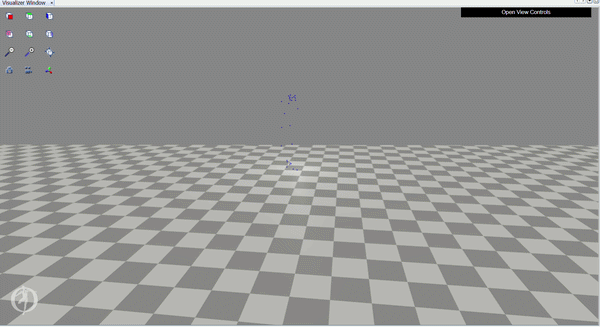
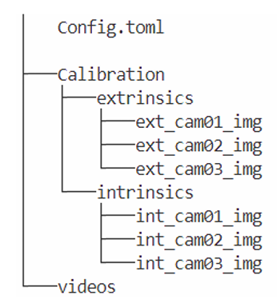
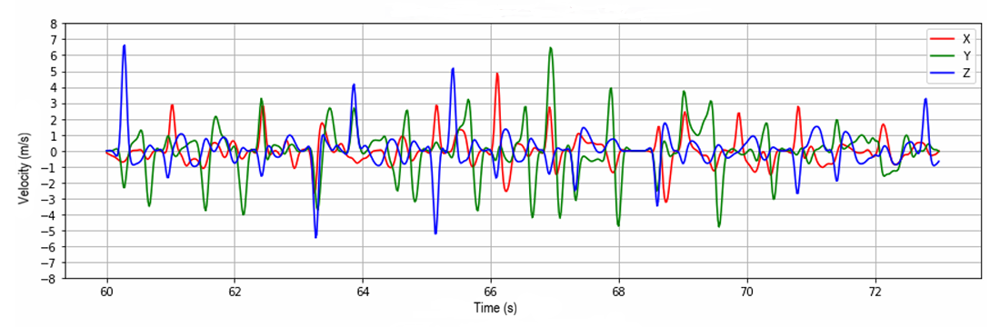
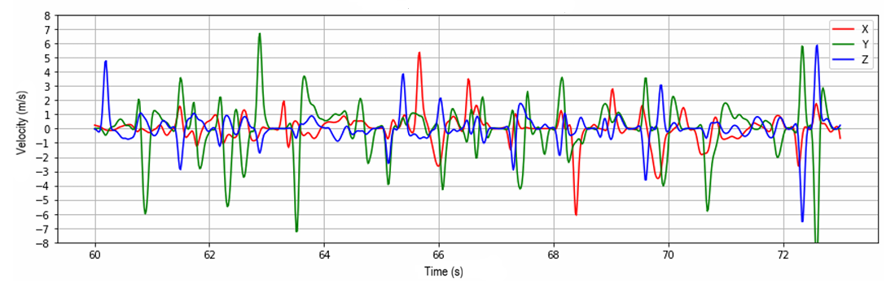
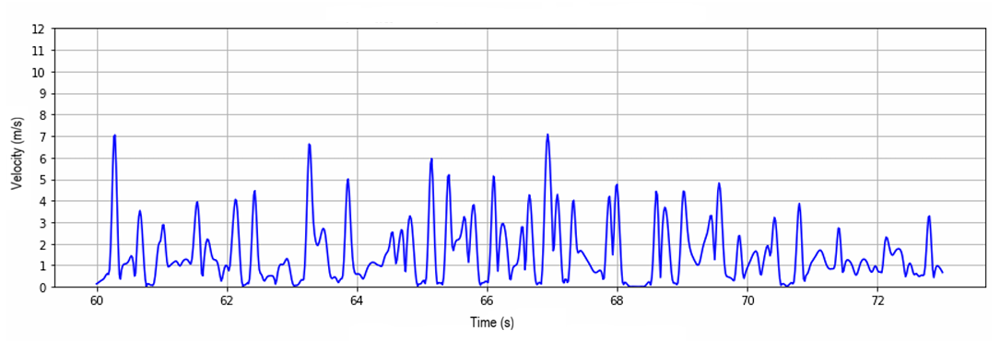

# Boxing Punch Velocity Analysis — Markerless 3D Motion Capture

[](https://www.python.org/)
[](https://github.com/perfanalytics/pose2sim)
[](https://scipy.org/)

> Multi-camera markerless pipeline for 3D punch velocity estimation in ecological conditions. Developed within the REVEA research program — French Boxing Federation × M2S Laboratory, Rennes 2 University.



## Context

The REVEA program uses virtual reality to optimize athletic performance. Researchers at the M2S Laboratory needed to measure real punch velocities to compare boxer performance between real and virtual environments.

The constraint: motion capture had to be markerless, as recordings take place during real sparring sessions without interrupting athletes.

The goal was to develop and validate a markerless video-based method for punch velocity measurement, for future integration into the REVEA VR/real comparison protocol.


## Approach

Four solutions were evaluated: Sports2D, DeepLabCut, and OpenCV (2D approaches), and **Pose2Sim** (3D). **[Pose2Sim](https://github.com/perfanalytics/pose2sim)** was selected. It is an open-source pipeline developed by David Pagnon connecting multi-camera pose estimation to biomechanical analysis.

The original setup used 3 GoPro cameras in the boxing ring. Extrinsic calibration attempts with both checkerboard and scene-point methods did not yield exploitable results, due to fish-eye distortion on the overhead camera and large inter-camera distances.

A controlled proof-of-concept was conducted using 2 synchronized smartphones in a lab environment, where calibration conditions could be optimized. This setup produced the results presented below.




## Pipeline

```
2 synchronized smartphones (1080p, 60fps)
        │
        ▼
Pose2Sim
 ├── Intrinsic calibration   (checkerboard)
 ├── Extrinsic calibration   (checkerboard)
 ├── Camera synchronization  (vertical jump signal)
 ├── Pose estimation
 ├── 3D triangulation
 └── Filtering
        │
        ▼
.trc output — 3D joint positions over time
        │
        ▼
punch_velocity.py
 ├── Wrist position extraction
 ├── Velocity per axis (np.gradient)
 ├── Resultant velocity
 └── Punch detection (scipy.signal.find_peaks)
```

## Velocity Computation

3D wrist positions from the `.trc` file are used as a proxy for fist velocity. Velocity components on each axis are obtained by numerical time differentiation. The resultant velocity is computed as:

$$v = \sqrt{v_x^2 + v_y^2 + v_z^2}$$

Full implementation in `punch_velocity.py`. Raw `.trc` data not included for privacy reasons.

### Velocity components per axis


<p align="center"><em>Left wrist — Subject 1</em></p>


<p align="center"><em>Right wrist — Subject 1</em></p>

### Resultant velocity and punch detection

Peaks above ~4 m/s correspond to effective punches. Below this threshold, movements reflect guard positioning and repositioning.


<p align="center"><em>Left wrist — Subject 1</em></p>


<p align="center"><em>Right wrist — Subject 1</em></p>

## Results

Proof-of-concept on two subjects performing boxing sequences.

| Subject | Wrist | Max velocity (m/s) | Mean velocity (m/s) |
|---------|-------|--------------------|---------------------|
| Subject 1 | Right | 11.41 | 6.21 |
| Subject 1 | Left  | 7.08  | 5.32 |
| Subject 2 | Right | 8.48  | 6.39 |
| Subject 2 | Left  | 4.80  | 4.74 |

For reference, punch velocities in amateur boxing typically range from 4 to 8 m/s.


## Key Challenges

**Fish-eye overhead camera** — The overhead GoPro required fish-eye mode to cover the full ring area, significantly complicating extrinsic calibration. Multiple checkerboard sizes and distances were tested without reaching sufficient precision for the ring setup.

**Multi-person pose estimation** — Pose2Sim's multi-person mode produced unstable reconstructions due to occlusions and overlapping limbs during sparring. Single-subject processing on isolated sequences was adopted.

**Camera synchronization** — Initial cross-correlation scores were below 0.5. A vertical jump at the start of each recording provided a reliable temporal alignment signal.

## Tech Stack

| Category | Tools |
|----------|-------|
| 3D markerless capture | [Pose2Sim](https://github.com/perfanalytics/pose2sim) (Pagnon, 2022) |
| Programming | Python |
| Signal processing | NumPy, SciPy |
| Visualization | Matplotlib |
| Hardware | GoPro ×3 (ring), Smartphones ×2 (proof-of-concept) |

## Limitations

- Proof-of-concept on two non-competitive subjects — not designed to evaluate sports performance
- Wrist used as proxy for fist velocity
- GoPro multi-camera calibration not resolved — ecological deployment pending
- No ground-truth comparison with marker-based systems

## Academic Reference

> Birba, J., Giot, B., Le Gall, M. (2024). Markerless 3D estimation of boxing punch velocity in ecological conditions. Master 2, DigiSport Graduate School, Université Rennes 2. REVEA Research Program, M2S Laboratory × French Boxing Federation.

*Project conducted as part of a team. Python implementation, Pose2Sim pipeline and data processing: J. Birba.*


*Jérémy Birba — [LinkedIn](https://linkedin.com/in/birba-jeremy) | [GitHub](https://github.com/JeremyDataHub)*
